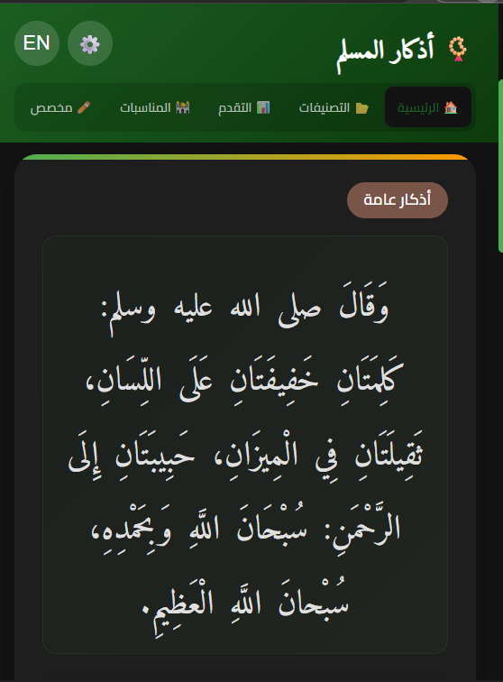
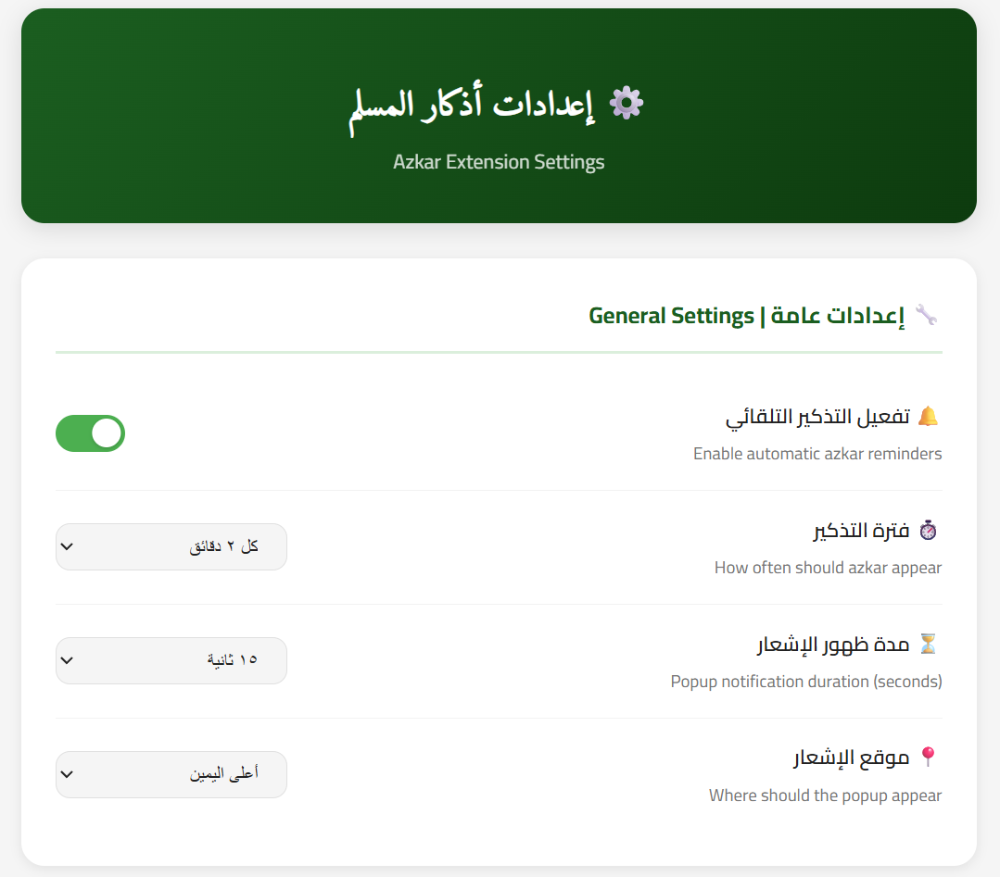
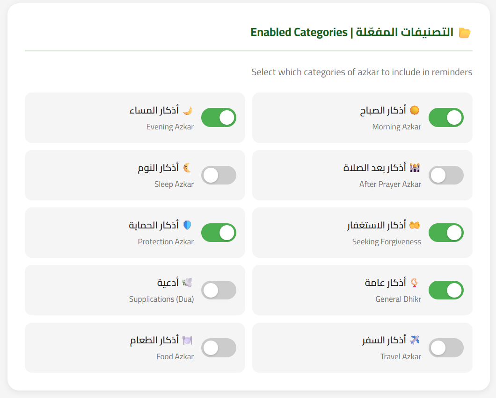
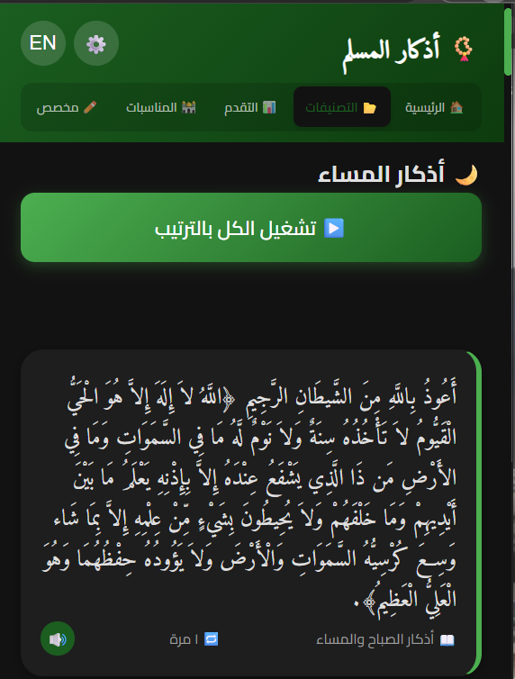
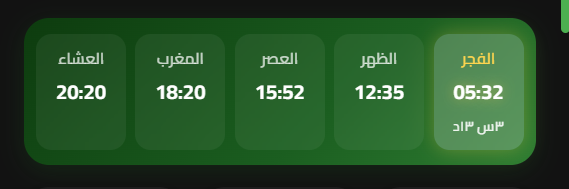

# 📿 Azkar - أذكار المسلم

<div align="center">
  <p align="center">
    <b>A feature-rich Chrome extension for daily remembrances, prayer times, Quran Radio, Hadith collections, and more.</b>
  </p>
  <p><b>Version 1.0.0</b></p>
</div>

---

## ✨ Features

### 🕌 Prayer Times & Calendar

- Accurate prayer times based on your location with adhan notifications.
- Hijri calendar display.

### 📖 Azkar Library

- Morning, evening, and Quranic supplications.
- Audio recitations — listen to individual or sequential azkar.
- Smart overlay reminders with customizable timing.

### 📊 Progress Tracking

- Daily dhikr counters with a compact progress ring.
- Track your streaks and daily goals.

### 📻 Quran Radio

- Stream live Quran radio stations from dozens of reciters.
- Persistent audio playback that continues while browsing.
- Volume control and station switching.

### 📜 Hadith Tab

- **40 Nawawi Collection** — All 42 hadiths with full Arabic text, narrator, source, and scholarly explanations (شرح).
- **Hadith Categories** — Browse hadiths by category from the HadeethEnc API (7 root categories).
- Supports 4 languages: Arabic, English, French, and Urdu.

### 🤲 Daily Hadith

- Random hadith displayed on the main tab, refreshed daily.
- Retry logic with automatic fallback.

### 🌐 Multi-language Support

- Full interface available in Arabic, English, French, and Urdu.

### 🔔 Smart Reminders

- Background event reminders for Islamic occasions.
- Customizable notification overlay on all web pages.

---

## 📸 Screenshots

<div align="center">
  <table>
    <tr>
      <td align="center"><br></td>
      <td align="center"><br></td>
    </tr>
    <tr>
      <td align="center"><br></td>
      <td align="center"><br></td>
    </tr>
    <tr>
      <td colspan="2" align="center"><br></td>
    </tr>
  </table>
</div>

---

## 🚀 Installation

1.  **Clone the repository:**
    ```bash
    git clone [https://github.com/MahMoudMostaAfa/Azkar-Extension.git](https://github.com/MahMoudMostaAfa/Azkar-Extension.git)
    ```
2.  Open **Chrome** and go to `chrome://extensions/`.
3.  Enable **Developer mode** (top-right).
4.  Click **Load unpacked** and select the project folder.

---

## 🛠️ Tech Stack

- **Chrome Extension Manifest V3**
- **Vanilla JavaScript** (ES Modules)
- **Offscreen Document** for persistent audio playback
- **Service Worker** for background alarms & reminders
- **APIs:** [Aladhan](https://aladhan.com/) (prayer times), [MP3Quran](https://mp3quran.net/) & [Qurango](https://qurango.net/) (radio), [HadeethEnc](https://hadeethenc.com/) (hadiths)

---

## 📂 Project Structure

```
├── background/       # Service worker for alarms & reminders
├── content/          # Content scripts & notification overlay
├── data/             # Static data (azkar, nawawi hadiths, events)
├── icons/            # Extension icons
├── js/               # Shared modules (API, audio, i18n, utils)
├── offscreen/        # Offscreen document for persistent audio
├── options/          # Settings page
├── popup/            # Main popup UI (tabs: home, azkar, radio, hadith)
└── manifest.json
```

---

## 📄 License

This project is licensed under the MIT License — see the [LICENSE](LICENSE) file for details.
